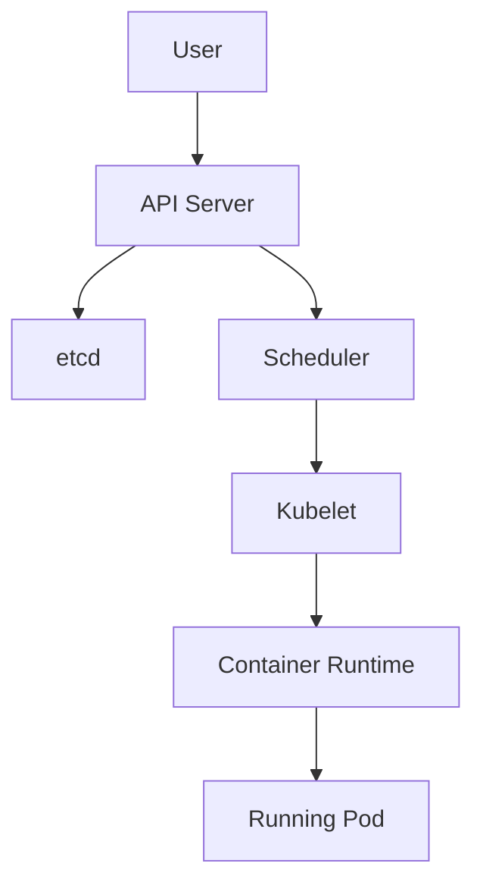

# Day 01

## Kubernetes Cluster Architecture

Kubernetes is a container orchestration system that manages workloads across a cluster of machines. A cluster is made of a control plane and one or more worker nodes.

The control plane makes decisions about the cluster. Worker nodes run the actual application workloads.

- Control plane: Accepts requests, stores cluster state, schedules workloads, and reconciles desired state.
- Worker nodes: Run Pods, connect workloads to the network, and report status back to the control plane.
- Desired state: The configuration you ask Kubernetes to maintain.
- Reconciliation: The process Kubernetes uses to compare current state with desired state and take action.

## Control Plane vs. Worker Nodes

| Area | Control Plane | Worker Node |
| --- | --- | --- |
| Main role | Manages cluster state and decisions | Runs application workloads |
| Key components | API Server, etcd, Scheduler, Controller Manager | Kubelet, kube-proxy, container runtime, CNI |
| Stores cluster state? | Yes, through etcd | No |
| Runs Pods? | Usually system Pods; may run workloads depending on cluster setup | Yes |
| Failure impact | Can affect scheduling and cluster management | Can affect workloads on that node |

## Core Components

- API Server: The front door to Kubernetes. All requests go through it.
- etcd: The key-value store that holds cluster state.
- Scheduler: Chooses which node should run a new Pod.
- Controller Manager: Runs controllers that keep the cluster moving toward desired state.
- Kubelet: Runs on each node and makes sure assigned Pods are running.
- kube-proxy: Handles Service networking rules on nodes.
- Container runtime: Starts and manages containers.
- CNI: Provides Pod networking.

## Request Flow

When a workload is created, Kubernetes follows a control loop:

## Checklist

- [ ] Identify the cluster nodes and their roles.
- [ ] Locate the system namespaces.
- [ ] Find the core Kubernetes Pods.
- [ ] Explain the role of the API Server, etcd, Scheduler, Controller Manager, Kubelet, kube-proxy, container runtime, and CNI.
- [ ] Describe the request flow from workload creation to a running Pod.

## Lab: Inspect Your Cluster

Use this lab to observe the cluster instead of creating new workloads. Day 01 is about understanding what already exists.

### Steps

1. List all nodes and identify control plane and worker nodes: `kubectl get nodes -o wide`
2. Inspect all namespaces: `kubectl get namespaces`
3. Inspect system Pods: `kubectl get pods -n kube-system -o wide`
4. Inspect cluster info: `kubectl cluster-info`
5. Describe one node and note its conditions: `kubectl describe node <node-name>`
   - Note: A Kubernetes node does not always mean a separate physical machine. In local clusters, multiple nodes can run on one machine as VMs or containers.
6. Describe one system Pod and explain what it does: `kubectl describe pod <pod-name> -n kube-system`

---

[Back to main README.md](../README.md)
