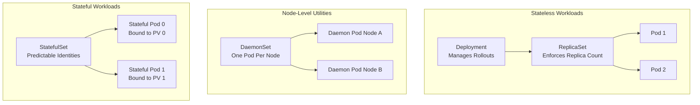

# Day 03

## Deployments, ReplicaSets, DaemonSets, StatefulSets, and Rollouts

In Kubernetes, you almost never deploy individual Pods directly in production. Instead, you define high-level controller objects that manage the lifecycle, scaling, self-healing, and rolling updates of your Pods. This lab covers the four core workload controllers, as well as how to perform and roll back application updates.

## Core Workload Controllers Comparison

| Controller | Use Case | State | Scaling Model | Pod Identity |
| --- | --- | --- | --- | --- |
| **Deployment** | Stateless apps (e.g. web servers, APIs) | Stateless | Replica-based scaling across any available nodes | Ephemeral, random names (e.g. `web-57bfb7b9c-xyz`) |
| **ReplicaSet** | Maintained by Deployments; ensures specified replica count is running | Stateless | Replica-based scaling | Ephemeral, random names |
| **DaemonSet** | Node-level system utilities (e.g. logging agents, monitoring exporters) | Stateless | One Pod per eligible node (automatically scales with node additions) | Ephemeral, usually node-prefixed |
| **StatefulSet** | Stateful apps requiring stable storage and networking (e.g. databases, MQ) | Stateful | Ordered, sequential scaling (0 to N-1) | Stable, predictable names (e.g. `db-0`, `db-1`) |

## Controller Relationships and Hierarchy

The diagram below maps how the various workload controllers manage their underlying Pods. Notice how a **Deployment** does not manage Pods directly, instead, it manages a **ReplicaSet**, which in turn manages the individual Pods.



## Rollouts and Rollbacks

Deployments support declarative, zero-downtime updates using a **RollingUpdate** strategy. This strategy is governed by two critical parameters:
- **`maxSurge`:** The maximum number of Pods that can be created above the desired replica count during an update (expressed as a number or percentage).
- **`maxUnavailable`:** The maximum number of Pods that can be unavailable during an update.

When you modify a Deployment spec (such as updating the container image version):
1. The Deployment creates a **new ReplicaSet** for the new image.
2. It scales up the new ReplicaSet and scales down the old ReplicaSet incrementally, adhering to `maxSurge` and `maxUnavailable` limits.
3. If the new version is broken, you can execute a **rollback** to instantly return to the previous stable ReplicaSet revision.

## Checklist

- [ ] Explain the difference between stateless Deployments and StatefulSets.
- [ ] Describe why Deployments use ReplicaSets under the hood.
- [ ] Explain how a DaemonSet behaves when new nodes are added to a cluster.
- [ ] Perform a rolling update on a Deployment and track its status.
- [ ] Roll back a failed deployment update to a previous revision.
- [ ] Inspect the Pod naming conventions for Deployments vs. StatefulSets.

## Lab: Managing Deployments, DaemonSets, and Rollouts

In this lab, you will deploy core workloads, execute a rolling update, trigger a failure, and roll back to a stable state.

### Steps

1. **Deploy the Stateless Application:**
   Apply the Deployment manifest:
   ```bash
   kubectl apply -f day-03/manifests/01-deployment.yaml
   ```
   Verify the Deployment, ReplicaSet, and Pods:
   ```bash
   kubectl get deployments
   kubectl get replicasets
   kubectl get pods -l app=web-app
   ```
   Note the random strings in the Pod names generated by the ReplicaSet.

2. **Deploy the Node Daemon:**
   Apply the DaemonSet manifest (simulating a logging agent):
   ```bash
   kubectl apply -f day-03/manifests/02-daemonset.yaml
   ```
   Verify that a Pod has been scheduled on every available worker node:
   ```bash
   kubectl get daemonsets
   kubectl get pods -l app=log-agent -o wide
   ```

3. **Deploy the Stateful Workload:**
   Apply the StatefulSet manifest (simulating a database):
   ```bash
   kubectl apply -f day-03/manifests/03-statefulset.yaml
   ```
   Observe the sequential creation of the Pods:
   ```bash
   kubectl get statefulsets
   kubectl get pods -l app=database
   ```
   Notice that the Pods are named deterministically (`db-0`, `db-1`) rather than randomly, and they start up one after the other.

4. **Execute a Rolling Update:**
   Update the Deployment image to a newer version:
   ```bash
   kubectl set image deployment/web-deployment web-container=nginx:1.25.4-alpine
   ```
   Watch the rollout in real-time to observe the rolling update process:
   ```bash
   kubectl rollout status deployment/web-deployment
   ```
   Observe that a new ReplicaSet was created and the old one was scaled down.

5. **Simulate a Failed Update and Rollback:**
   Trigger an update using a non-existent container image to simulate a broken release:
   ```bash
   kubectl set image deployment/web-deployment web-container=nginx:broken-version
   ```
   Check the status of the rollout (it will hang):
   ```bash
   kubectl rollout status deployment/web-deployment --timeout=15s
   ```
   View the failing Pods (they will show `ImagePullBackOff` or `ErrImagePull`):
   ```bash
   kubectl get pods -l app=web-app
   ```
   View the rollout history to find the stable revision:
   ```bash
   kubectl rollout history deployment/web-deployment
   ```
   Roll back to the last stable revision:
   ```bash
   kubectl rollout undo deployment/web-deployment
   ```
   Verify that the Deployment is healthy again:
   ```bash
   kubectl rollout status deployment/web-deployment
   ```

6. **Clean Up:**
   Delete all resources created during this lab:
   ```bash
   kubectl delete -f day-03/manifests/
   ```

---

[Back to main README.md](../README.md)
