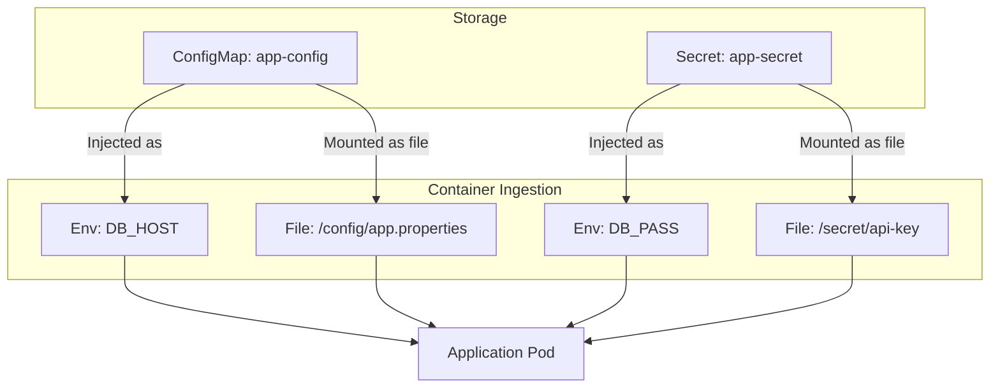

# Day 05

## ConfigMaps and Secrets

A core principle of cloud-native application design is the separation of configuration from code. You should never hardcode database credentials, API keys, or environment-specific settings (like dev vs. prod URLs) inside your container images. If you do, you must rebuild the image every time a configuration changes.

Kubernetes solves this using **ConfigMaps** (for non-sensitive settings) and **Secrets** (for sensitive data like passwords or tokens). These resources decouple configuration from execution, allowing your container images to remain completely immutable.

## ConfigMaps vs. Secrets Comparison

| Characteristic | ConfigMap | Secret |
| --- | --- | --- |
| **Data Type** | Non-sensitive configurations (settings, files) | Sensitive credentials (passwords, TLS certs, API keys) |
| **Typical Use Cases** | Database hostnames, feature flags, application logs | Database passwords, API tokens, SSH keys |
| **Default Encoding** | Plain text | Base64 encoded (in YAML manifests) |
| **Security Posture** | Readable by anyone with read access to the namespace | Masked in standard CLI output; can be encrypted at rest in etcd |

## How Configurations are Injected into Pods

Both ConfigMaps and Secrets can be injected into containers in two primary ways:
1. **Environment Variables:** Injected at container startup. Fast and simple, but changes require a Pod restart to take effect.
2. **Volume Mounts (Mounted Files):** Mounted as files inside a virtual directory. Highly secure, and Kubernetes automatically updates the files when the ConfigMap or Secret changes without restarting the container.



> [!IMPORTANT]
> **Kubernetes Secrets are NOT encrypted by default!** They are merely Base64-encoded strings, which means anyone who can access the YAML can decode them in a single command. In production, you must secure Secrets using Kubernetes Role-Based Access Control (RBAC), enable encryption at rest in etcd, or integrate external vaults like HashiCorp Vault.

## Checklist

- [ ] Explain why hardcoding configurations inside container images is an anti-pattern.
- [ ] Describe the difference between a ConfigMap and a Secret.
- [ ] Understand that Base64 encoding is not encryption.
- [ ] Inject configuration settings into a Pod using environment variables.
- [ ] Mount a ConfigMap as a directory of files inside a container.
- [ ] Update a mounted ConfigMap and observe the file hot-reload inside the container without restarting.

## Lab: Injecting Configurations and Secrets

In this lab, you will deploy a ConfigMap and a Secret, inject them into an application pod as both environment variables and mounted files, and observe how Kubernetes dynamically reloads configurations.

### Steps

1. **Create the Configurations:**
   Apply the ConfigMap and Secret manifests:
   ```bash
   kubectl apply -f day-05/manifests/01-configmap.yaml
   kubectl apply -f day-05/manifests/02-secret.yaml
   ```
   Verify that they were created:
   ```bash
   kubectl get configmaps
   kubectl get secrets
   ```

2. **Deploy the Configured Application:**
   Apply the Pod manifest which consumes the ConfigMap and Secret:
   ```bash
   kubectl apply -f day-05/manifests/03-pod-config.yaml
   ```
   Verify the Pod is running:
   ```bash
   kubectl get pods -l app=config-demo
   ```

3. **Verify Environment Variable Injection:**
   Execute a command inside the Pod to check the injected environment variables:
   ```bash
   kubectl exec config-demo-pod -- env | grep -E "APP_MODE|DB_USER|API_KEY"
   ```
   Notice that the `API_KEY` was successfully decoded from its Base64 format by Kubernetes and injected as plain text inside the container runtime environment.

4. **Verify Mounted File Ingestion:**
   Check the contents of the mounted configuration files:
   ```bash
   kubectl exec config-demo-pod -- cat /etc/config/app.properties
   ```
   Check the contents of the mounted secret file:
   ```bash
   kubectl exec config-demo-pod -- cat /etc/secrets/api-key.txt
   ```

5. **Observe Dynamic Hot-Reloading:**
   Let's modify the ConfigMap to change the application settings. Edit the local `day-05/manifests/01-configmap.yaml` file to change `app.properties` or `APP_MODE` (e.g. change `APP_MODE: development` to `APP_MODE: production`), then apply the changes:
   ```bash
   kubectl apply -f day-05/manifests/01-configmap.yaml
   ```
   Wait about 30 to 60 seconds (Kubernetes periodically syncs mounted volumes), and then check the mounted file again:
   ```bash
   kubectl exec config-demo-pod -- cat /etc/config/app.properties
   ```
   Observe that the file inside the container **updated automatically** without restarting the Pod! 
   *(Note: If you check the environment variables, they will still show the old value, because env vars are static and only set during container startup.)*

6. **Clean Up:**
   Delete all resources created during this lab:
   ```bash
   kubectl delete -f day-05/manifests/
   ```

---

[Back to main README.md](../README.md)
