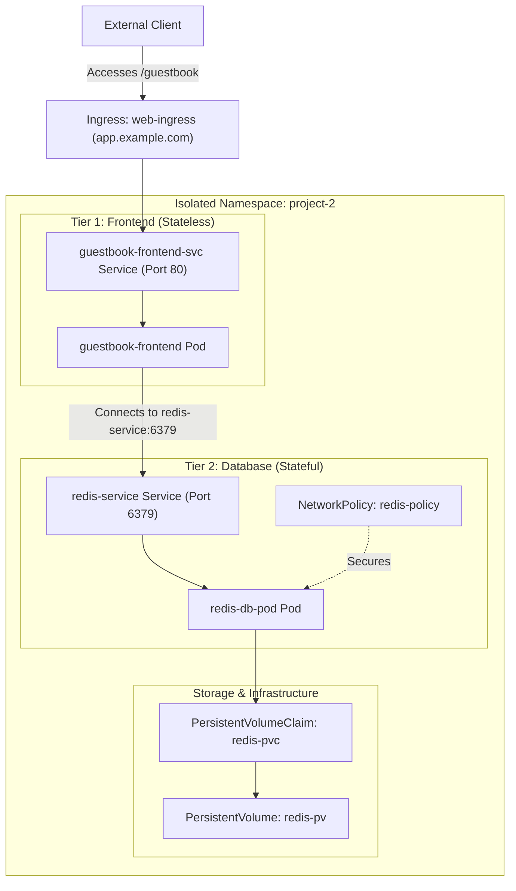

# Day 14

## Project 2: Build and Troubleshoot a Networked Stateful Application

Congratulations on completing **Phase 2: Scheduling, Networking, and Storage**! You have covered:
* Day 08: Resource Requests, Limits, and QoS Classes
* Day 09: Node Selectors, Affinity, and Anti-Affinity
* Day 10: Taints and Tolerations
* Day 11: PersistentVolumes, PersistentVolumeClaims, and StorageClasses
* Day 12: NetworkPolicies for Traffic Control
* Day 13: Ingress Controllers and HTTP Routing

Today is a practical project day designed to consolidate all of these concepts into a single, secure, multi-tier stateful application.

## Project Architecture

You will deploy a Guestbook application consisting of a web frontend that lets users submit messages, and a Redis database that stores the entries. The system must meet these architectural specifications:

1. **Storage Layer:** The Redis database must persist data using a statically bound `PersistentVolume` (`hostPath` directory) and a `PersistentVolumeClaim`.
2. **Network Security:** A `NetworkPolicy` must isolate the Redis database, allowing ingress connections **only** from the frontend Pod on port `6379`. All other traffic to the database must be blocked.
3. **Ingress Routing:** The web frontend must be exposed externally using an `Ingress` resource on host `app.example.com` and path `/guestbook`.



## Troubleshooting Guide (Common Failures)

The initial manifests located in `day-14/manifests/broken/` contain three deliberate configuration errors. Use your troubleshooting skills to identify and fix:

1. **Redis Pod remains stuck in `Pending` (Storage Class Mismatch):**
   * *Possible Cause:* The PersistentVolumeClaim requests a storage class that does not match the PersistentVolume or is not supported by the cluster.
   * *Solution:* Check `kubectl describe pvc redis-pvc -n project-2`. Verify that `storageClassName` values match between the PV and PVC, or set them to empty string `""` to allow manual binding to the local PV.

2. **Frontend cannot connect to Redis (NetworkPolicy Selector Mismatch):**
   * *Possible Cause:* The NetworkPolicy restricts ingress to the Redis pod using labels that do not match the actual labels on the frontend pod.
   * *Solution:* Verify pod labels with `kubectl get pods -n project-2 --show-labels`. Align the NetworkPolicy's `podSelector` matchLabels with the frontend Pod's labels (e.g., using `app: frontend` for both).

3. **External access via Ingress returns HTTP 502/503 or 404 (Target Port Mismatch):**
   * *Possible Cause:* The Ingress resource points to a port number that the backend Service is not listening on.
   * *Solution:* Inspect Ingress routing rules with `kubectl describe ingress web-ingress -n project-2` and compare the target backend port with the port defined in the Service manifest (e.g., port `80` instead of `8080`).

## Manifest Differences (Broken vs Fixed)

<details>
<summary>Reveal Manifest Differences and Explanations</summary>

Here is a detailed comparison of the changes made between the `broken` and `fixed` manifests to resolve the three deliberate configuration errors:

**1. Storage Configuration (`02-storage.yaml`)**

```diff
--- day-14/manifests/broken/02-storage.yaml
+++ day-14/manifests/fixed/02-storage.yaml
@@ -12,2 +12,2 @@
-  storageClassName: "manual"
+  storageClassName: ""
@@ -24,2 +24,3 @@
-  storageClassName: "standard"
+  storageClassName: ""
+  volumeName: redis-pv
```

**Why this change is required:**
* **StorageClass Mismatch:** The PV originally defined `"manual"` and the PVC requested `"standard"`. They must match exactly.
* **Static Volume Binding:** Setting both to `""` prevents dynamic provisioning, and specifying `volumeName: redis-pv` binds them statically.
* *Note:* Since the `storageClassName` field on a PVC is immutable, you must delete the existing PVC/namespace and recreate them to apply this change.

**2. Network Security Configuration (`04-frontend.yaml`)**

```diff
--- day-14/manifests/broken/04-frontend.yaml
+++ day-14/manifests/fixed/04-frontend.yaml
@@ -7,2 +7,2 @@
-    app: guestbook-web
+    app: frontend
@@ -25,2 +25,2 @@
-    app: guestbook-web
+    app: frontend
```

**Why this change is required:**
* **Label/Selector Match:** The database NetworkPolicy (`05-networkpolicy.yaml`) specifies that ingress traffic is only allowed from pods with the label `app: frontend`.
* Aligning the Pod labels and Service selectors to `app: frontend` authorizes the frontend container to establish connections to the Redis backend on port `6379`.

**3. Ingress Routing Configuration (`06-ingress.yaml`)**

```diff
--- day-14/manifests/broken/06-ingress.yaml
+++ day-14/manifests/fixed/06-ingress.yaml
@@ -17,1 +17,1 @@
-              number: 8080
+              number: 80
```

**Why this change is required:**
* **Service Port Alignment:** The frontend Service exposing the application is defined with port `80`.
* The broken Ingress rule targeted backend port `8080`, leading to a connection failure (502 Bad Gateway / 503 Service Unavailable). Setting the target port to `80` matches the service definition.

</details>


## Project Checklist

- [ ] Create an isolated namespace `project-2`.
- [ ] Configure local persistent storage via a `PersistentVolume` and a `PersistentVolumeClaim`.
- [ ] Deploy the Redis database backend utilizing the PVC for persistence.
- [ ] Restrict database network traffic via a `NetworkPolicy` that only accepts traffic from the frontend.
- [ ] Deploy the web frontend application.
- [ ] Configure an `Ingress` resource to route external traffic on `app.example.com/guestbook` to the frontend service.
- [ ] Debug the deliberate failures in the `broken/` manifests.
- [ ] Correct the issues in the `fixed/` manifests and verify the complete application works as designed.

## Project Steps

To execute the project, navigate to the `day-14` directory. You will first deploy the broken manifests to diagnose the failures, then deploy the fixed manifests.

### Part 1: Deploy and Diagnose the Broken App

1. **Apply the Broken Manifests:**
   ```bash
   kubectl apply -f day-14/manifests/broken/01-namespace.yaml
   kubectl apply -f day-14/manifests/broken/02-storage.yaml
   kubectl apply -f day-14/manifests/broken/03-redis-db.yaml
   kubectl apply -f day-14/manifests/broken/04-frontend.yaml
   kubectl apply -f day-14/manifests/broken/05-networkpolicy.yaml
   kubectl apply -f day-14/manifests/broken/06-ingress.yaml
   ```

2. **Diagnose Storage Binding Failure:**
   Check the status of the pods:
   ```bash
   kubectl get pods -n project-2
   ```
   Identify that the database pod is `Pending`. Describe the PVC to find the binding error:
   ```bash
   kubectl describe pvc redis-pvc -n project-2
   ```

3. **Clean Up Broken Resources:**
   Delete the resources before applying the fixed manifests:
   ```bash
   kubectl delete namespace project-2
   kubectl delete pv redis-pv
   ```

### Part 2: Deploy and Verify the Fixed App

1. **Apply the Fixed Manifests:**
   ```bash
   kubectl apply -f day-14/manifests/fixed/01-namespace.yaml
   kubectl apply -f day-14/manifests/fixed/02-storage.yaml
   kubectl apply -f day-14/manifests/fixed/03-redis-db.yaml
   kubectl apply -f day-14/manifests/fixed/04-frontend.yaml
   kubectl apply -f day-14/manifests/fixed/05-networkpolicy.yaml
   kubectl apply -f day-14/manifests/fixed/06-ingress.yaml
   ```

2. **Verify Storage and Pod Status:**
   Confirm that both pods are in `Running` status and the PVC is `Bound`:
   ```bash
   kubectl get pvc -n project-2
   kubectl get pods -n project-2
   ```

3. **Verify Frontend to Database Connectivity:**
   Test network policy access from the frontend pod to Redis:
   ```bash
   kubectl exec guestbook-frontend -n project-2 -- nc -zv redis-service 6379
   ```

4. **Verify Ingress Routing:**
   Simulate external client routing using a custom Host header:
   ```bash
   curl -H "Host: app.example.com" http://localhost/guestbook
   ```

5. **Clean Up:**
   Delete the namespace to remove all project resources:
   ```bash
   kubectl delete namespace project-2
   kubectl delete pv redis-pv
   ```

---

[Back to main README.md](../README.md)
